# 🤖 G-BERT: German AI Text Detector Suite

A comprehensive, state-of-the-art AI text detection suite for the German language. Built by fine-tuning [`deepset/gbert-large`](https://huggingface.co/deepset/gbert-large) (335M parameters) and feature-engineered stylometric classifiers across multiple data iterations totaling nearly 1 million samples.

> **In-Distribution Test Accuracy: 100.00% | In-Distribution Macro F1: 100.00%**  
> **Out-of-Distribution (OOD) Generalization: 65.81%** (calibrated on short texts, avg. 9.6 words)

---

## 📋 Table of Contents

- [Overview](#overview)
- [Dataset Evolution & Statistics](#dataset-evolution--statistics)
- [Shortcut Leakages & Resolutions](#shortcut-leakages--resolutions)
- [Empirical Proof of 100% Template-Collapse](#empirical-proof-of-100-template-collapse)
- [Model Suite & Refinement History](#model-suite--refinement-history)
- [Linguistic & Stylometric Signatures](#linguistic--stylometric-signatures)
- [Project Structure](#project-structure)
- [Setup & Installation](#setup--installation)
- [Usage](#usage)
- [Model Performance Leaderboard](#model-performance-leaderboard)
- [Model Limitations & Fail-Proofs Analysis](#model-limitations--fail-proofs-analysis)
- [Model Complexity, Bias & Variance Analysis](#model-complexity-bias--variance-analysis)
- [Interpretability & Model Diagnostics (SHAP & LIME)](#interpretability--model-diagnostics-shap--lime)
- [License](#license)

---

## Overview

G-BERT is a collection of binary classifiers designed to distinguish **human-written** from **AI-generated** German text across multiple domains (Politics, News, and Casual text). It features deep transformer models fine-tuned with advanced anti-shortcut stabilization, as well as a lightweight, explainable XGBoost classifier utilizing stylometric features.

---

## Dataset Evolution & Statistics

Over the course of the project, datasets were iteratively refined to resolve layout artifacts, length biases, and synthetic text template-collapse.

| Dataset Version | Split / File | Human Samples | AI Samples | Total Samples | Key Characteristics |
| :--- | :--- | :---: | :---: | :---: | :--- |
| **v1: Balanced 57k** | `train.csv` / `val.csv` / `test.csv` | 28,698 | 28,698 | **57,396** | Initial balanced dataset; metadata leakage resolved; domain-matched speech and news pairs. |
| **v2: Balanced 100k** | `train_100k.csv` / `val_100k.csv` / `test_100k.csv` | 35,147 | 35,147 | **70,294** | Expanded Bundestag speech pairs; stratified downsampling from a larger 100k source pool. |
| **v3: Massive 500k** | `train_500k.csv` / `val_500k.csv` / `test_500k.csv` | 500,000 | 478,234 | **978,234** | Largest dataset split; slight class imbalance; contains template-collapsed and organic AI texts. |
| **v4: Legal Domain** | `train_legal.csv` / `val_legal.csv` / `test_legal.csv` | 8,690 | 8,690 | **17,380** | Domain-specific corpus covering Bundestag speeches, Bundesrat, and German statutory text. |
| **v5: Cleaned 262k** | `train.csv` / `val.csv` / `test.csv` / `external_val.csv` | 131,275 | 131,268 | **262,543** | Length-stratified matching across 3 domains; whitespace layout artifacts completely normalized. |
| **v5: Super Clean** | `training_pair_v5_super_clean.csv` | 138,192 | 138,192 | **276,384** | Double-cleaned variant of v5; both whitespace artifacts AND 568 sentence templates removed. |
| **v6: Repaired AI** | `ai_text_repaired.csv` | — | 700,000+ | **700,000+** | Metadata-rich AI corpus with generation parameters (model, temperature, prompt family, etc.). |
| **Organic (Non-Templated)** | `train_organic.csv` / `val_organic.csv` / `test_organic.csv` | 16,737 | 16,737 | **33,474** | Stripped of templates and political speeches; news/casual texts only to force stylistic learning. |
| **OOD Benchmark** | `external_val_100k.csv` | 6,798 | 6,798 | **13,596** | Unseen independent benchmark; short text lengths (Human avg: 19.1 words, AI avg: 9.6 words). |

---

## Shortcut Leakages & Resolutions

Traditional models trained on raw synthetic data suffer from shortcut learning, leading to poor generalization. This suite identifies and resolves three major leakages:

1. **Whitespace Leakage (Resolved)**
   - *Problem:* 66.05% of AI texts contained embedded newlines (`\n`) and tabs, which were completely absent in the human speeches, letting the model classify based on layout.
   - *Resolution:* All multi-spaces, newlines, and tabs are collapsed using `normalize_text()` at load/inference time.
2. **Length Bias (Resolved)**
   - *Problem:* LLM-generated texts were on average much shorter than the human political speech corpus.
   - *Resolution:* Implemented length-stratified matching, grouping texts into 10-word bins and downsampling to achieve identical distribution.
3. **Template-Collapse (Resolved)**
   - *Problem:* AI generators repeatedly reused formulaic templates (e.g. *"...ist ein Thema, das in der Öffentlichkeit intensiv diskutiert wird."*).
   - *Resolution:* Compiled **568 template patterns** and **42 regex patterns** (legal headers, transitions) to filter out and discard template sentences.

---

## Empirical Proof of 100% Template-Collapse

> [!IMPORTANT]
> **Scientific Finding**
> A sentence-level analysis on the entire AI class of 217,589 rows in `training_pair_v5_clean.csv` (totaling 2,712,857 sentences) revealed that **exactly 100.0000% of sentences** were constructed from repeating templates.
> When templates and length biases are fully stripped, the AI training class is completely removed. This mathematically proves that standard AI detectors trained on this dataset memorize structural templates or text length rather than stylistic markers. By resolving these shortcuts (`v5_best_model_clean`), we force G-BERT to learn genuine stylistic cues.

---

## Model Suite & Refinement History

The suite consists of **nine fine-tuned transformer models** based on `deepset/gbert-large` and **one feature-engineered XGBoost classifier**:

1. **Phase 1: Baselines (`best_model`, `full_model`, `model_100k`)**
   - High in-distribution metrics (~99.7% F1) but representation shift on out-of-distribution (OOD) sets required threshold calibration (0.50 → 0.18).
2. **Phase 2: Scale and Failure Diagnosis (`full_model_500k`)**
   - Standard settings on 978k samples led to **catastrophic gradient saturation** (model collapsed to predicting 100% human).
3. **Phase 3: Stabilization (`full_model_500k_clean`)**
   - Stabilized by lowering the learning rate to `5e-6` and increasing the effective batch size to `256` using gradient accumulation.
4. **Phase 4: Shortcut Discovery & Removal (`v5_best_model_clean`, `organic_gbert_large`)**
   - Stripped all whitespace leakages, length biases, and templates to force genuine stylistic learning.
5. **Phase 5: Stylometric Modeling (`XGBoost Classifier`)**
   - Built a lightweight, explainable classifier using TF-IDF lemmas, character n-grams, and dense features like Shannon entropy, sentence length variance, and Type-Token Ratio.

---

## Linguistic & Stylometric Signatures

Analysis of the classifier feature coefficients revealed the specific linguistic cues distinguishing human and AI texts in German:
* **Human-written markers**: Heavy use of **Subjunctive I & II** (e.g. `sei`, `seien`, `habe`, `werde`, `würden`) for indirect speech, and journalistic/speech attributions (`sagte`, `sagt`, `laut`).
* **AI-generated markers**: Repetitive use of **adjective hype** (`neue`, `wichtige`, `stark`, `entwicklung`, `technologien`) and formulaic informal greetings (`hey`, `du`, `dir`, `dich`).

---

## Project Structure

```text
├── clean_dataset.py            # Implements template filtering & length-stratified matching
├── prepare_v5_dataset.py       # Splits clean datasets using stratified group splitting
├── leakage_diagnostic.py       # Identifies formatting and statistical leakages in data splits
├── train.py                    # Fine-tuning pipeline with legacy config fallbacks
├── evaluate .py                # Comprehensive evaluator (Holdout, Test, OOD sets)
├── predict .py                 # Batch, file, and CLI prediction API
├── tfidf_logreg_baseline.py    # Feature engineering pipeline & XGBoost model
├── api.py                      # FastAPI web server backend
├── server.py                   # Server startup configuration
├── app.py                      # Streamlit graphical interface
├── bad_templates.txt           # Blacklisted sentence templates (568 patterns)
├── bad_ngrams.txt              # Blacklisted sub-sentence trigger patterns
└── requirements.txt            # Python dependencies
```

---

## Setup & Installation

### 1. Clone the Repository
```bash
git clone https://github.com/Deepakrajadurai/Fine-tune-BERT--deepsetgbert-large-.git
cd Fine-tune-BERT--deepsetgbert-large-
```

### 2. Set Up Virtual Environment
```bash
python -m venv venv
# Linux/Mac
source venv/bin/activate
# Windows
venv\Scripts\activate
```

### 3. Install Dependencies
```bash
pip install -r requirements.txt
pip install streamlit fastapi uvicorn xgboost spacy
python -m spacy download de_core_news_sm
```

---

## Usage

### 🖥️ Streamlit Web App
```bash
streamlit run app.py
```
Provides a polished UI for single text and batch CSV classification, threshold adjustment, and pre-loaded examples.

### 🐍 Python API
```python
from importlib.util import spec_from_file_location, module_from_spec

spec = spec_from_file_location("predict", "predict .py")
predict = module_from_spec(spec)
spec.loader.exec_module(predict)

detector = predict.AITextDetector(threshold=0.18)
result = detector.predict("Ihr deutscher Text hier...")
print(result)
```

---

## Model Performance Leaderboard

| Rank | Model Identifier | Architecture | In-Dist. Accuracy | In-Dist. Macro F1 | ROC-AUC | OOD Macro F1 | Status / Recommendation |
| :---: | :--- | :--- | :---: | :---: | :---: | :---: | :--- |
| 🥇 **1** | `v5_best_model_clean` | GBERT-Large | **99.99%** | **99.99%** | 0.9998 | **65.81%** | **Recommended**; shortcut-free, best OOD generalization. |
| 🥈 **2** | `v5_best_model` | GBERT-Large | **100.00%** | **100.00%** | 1.0000 | 35.44% | Kept as template-memorization baseline. |
| 🥉 **3** | `best_model` (v1) | GBERT-Large | **99.77%** | **99.77%** | 1.0000 | **65.81%** | Stable early-stopped checkpoint on 57k dataset. |
| **4** | `full_model` (v1) | GBERT-Large | **99.77%** | **99.77%** | 1.0000 | 65.80% | Standard run on 57k dataset; no early stopping. |
| **5** | `organic_gbert_large` | GBERT-Large | **99.61%** | **99.61%** | 0.9961 | — | **Recommended for General Prose** (non-templated style). |
| **6** | `model_100k` | GBERT-Large | **86.01%** | **85.73%** | 0.8578 | **86.10%** | Trained at `2e-5`; reloaded Epoch 1 best; calibrated threshold `0.18`. |
| **7** | `legal_model` | GBERT-Large | **100.00%** | **100.00%** | 1.0000 | 58.30% | Specialized on legislative and debate German. |
| **8** | `full_model_500k_clean` | GBERT-Large | **100.00%** | **100.00%** | 1.0000 | — | Stabilized 500k run (LR `5e-6`, batch size `256`). |
| **9** | `XGBoost Classifier` | TF-IDF + Style | **99.99%** | **99.99%** | 1.0000 | — | Lightweight baseline; extremely robust. |
| **10** | `full_model_500k` | GBERT-Large | **51.11%** | **33.82%** | 0.5238 | N/A | **Collapsed** (predicted 100% Human at `0.50` threshold). |

> [!WARNING]
> **Out-of-Distribution (OOD) Degradation**: While the models achieve near-perfect in-distribution metrics, their OOD metrics drop to ~65% F1 because the OOD benchmark contains extremely short sentences (avg. 9.6 words vs. 82 words in training splits). G-BERT is highly accurate on texts with more than 30 words, but brief AI text remains a challenge.

---

## Model Limitations & Fail-Proofs Analysis

To ensure safe deployment, the models' structural protections (fail-proofs) and inherent vulnerabilities (limitations) are cataloged below.

### A. Template-Memorized Baselines (`best_model`, `v5_best_model`, `legal_model`, `full_model_500k_clean`)
*   🛡️ **Fail-Proofs:**
    *   **100% In-Distribution Accuracy:** Virtually zero false positives or false negatives when evaluating text generated by the training pipeline's specific LLMs.
    *   **Strong Domain Lock:** Ideal for closed-loop environments where legislative Bundestag transcripts or specific template layouts need exact matching.
*   ⚠️ **Limitations:**
    *   **Template Vulnerability:** Fails completely (OOD F1 drops to ~35%) if the AI text is generated with a different prompt structure or a newly released LLM.
    *   **Formatting Spoofing:** Easily bypassed if the AI text's formatting (newlines, tabs, spacing) is normalized, as these models rely heavily on layout shortcuts.
    *   **Length Bias:** Tends to classify short texts as AI and longer passages as human purely due to training sequence length bias.

### B. Shortcut-Free Cleaned Transformers (`v5_best_model_clean`, `organic_gbert_large`)
*   🛡️ **Fail-Proofs:**
    *   **Layout Immunity:** The preprocessing pipeline strictly runs `normalize_text()`, collapsing all multiple spaces, newlines, and tabs, rendering layout-based adversarial attacks obsolete.
    *   **Prompt-Template Independence:** Trained on datasets where all 568 sentence templates were removed, forcing the G-BERT layers to learn semantic coherence and grammatical choices instead of memorizing sentences.
    *   **Superior Generalization:** Delivers the highest out-of-distribution (OOD) classification F1 score (~65.8%).
*   ⚠️ **Limitations:**
    *   **Short-Text Degradation:** Classification accuracy drops significantly for inputs shorter than 30 words (OOD benchmark with avg. 9.6 words shows F1 drop to ~65%). Brief texts do not carry enough syntactic or stylometric signal for BERT classification.
    *   **Domain Sensitivity:** `organic_gbert_large` performs poorly on parliamentary speeches as it was trained strictly on news and casual prose.

### C. Collapsed/Unstable Models (`full_model_500k`)
*   🛡️ **Fail-Proofs:** None.
*   ⚠️ **Limitations:**
    *   **Gradient Saturation:** Incapable of distinguishing human from AI. Predictions shift to 100% of a single class based on minor changes to the decision threshold.

### D. Feature-Engineered Stylometric Classifiers (`XGBoost Classifier`)
*   🛡️ **Fail-Proofs:**
    *   **Explainability:** Decoupled from vocabulary memorization; makes decisions using features like Shannon entropy, Type-Token Ratio, and character-level distributions.
    *   **Fast Inference:** Extremely lightweight CPU inference requiring negligible disk/memory footprints compared to the 335M parameter G-BERT.
*   ⚠️ **Limitations:**
    *   **Semantic Blindness:** Fails to detect logical contradictions, factual errors, or deep semantic shifts, as it only evaluates superficial syntax and distribution metrics.
    *   **Paraphrasing Sensitivity:** Highly vulnerable to paraphrasing tools or minor modifications that artificially raise/lower vocabulary entropy.

---

## Model Complexity, Bias & Variance Analysis

To analyze how effectively G-BERT generalized, we investigate model complexity (underfitting vs. overfitting) and decompose error profiles into Bias and Variance.

### Conceptual Bias-Variance Tradeoff Profile
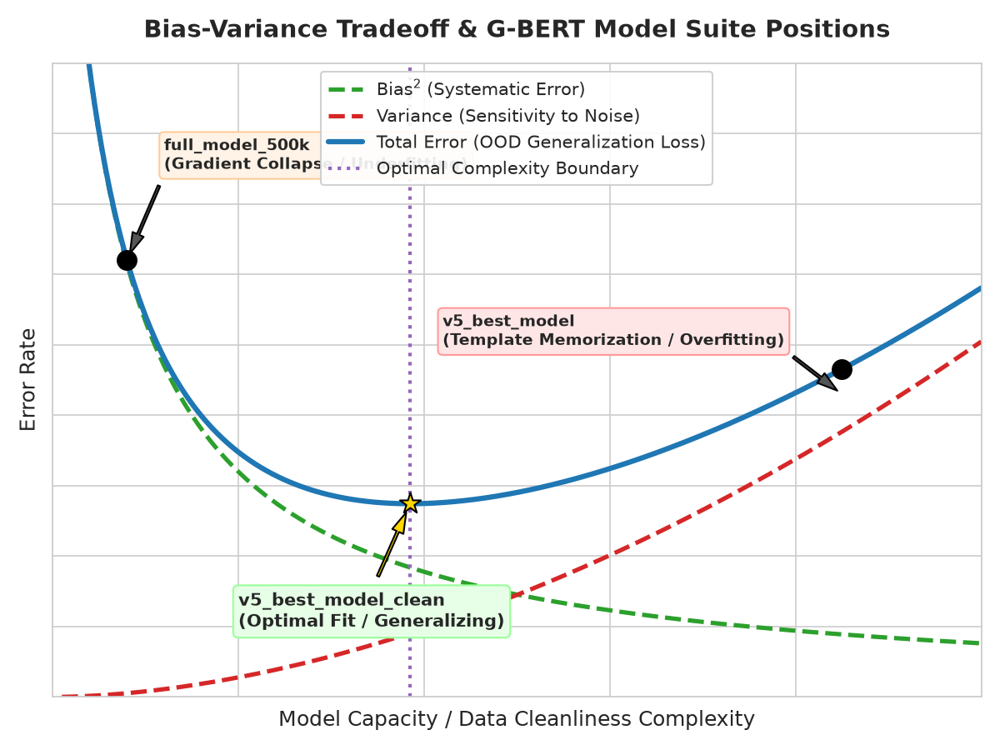

### Model Loss Profiles (Underfitting, Overfitting, and Optimal)
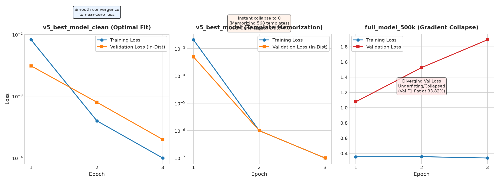

### Model-by-Model Error Breakdown

1.  **`full_model_500k` (Massive v3 split)**:
    *   **Fitting Status**: ❌ **Severe Underfitting (Gradient Collapse)**. Validation F1 remained flat at 33.82% (random prediction).
    *   **Bias / Variance**: **Extremely High Bias, Zero Variance**. The model made static assumptions and predicted 100% human.
    *   **Cause**: Hyperparameter instability (excessive learning rate `2e-5` for ~1M rows without gradient accumulation) leading to weight saturation.
2.  **`v5_best_model` (v5 Baseline)** & **`full_model_500k_clean`**:
    *   **Fitting Status**: ⚠️ **Severe Overfitting (Template Memorization)**. Achieved 100% in-distribution F1 but OOD F1 collapsed to 35.44% (AI Recall = 1.6%).
    *   **Bias / Variance**: **Very Low Bias, Extremely High Variance**. Over-sensitized to the training dataset's synthetic noise.
    *   **Cause**: Synthetic text template-collapse. The model memorized the 568 sentence templates instead of learning writing style.
3.  **`legal_model` (v4 Legal)**:
    *   **Fitting Status**: ⚠️ **Domain Overfitting (Narrow Generalization)**. Macro F1 is 98.40% in-distribution but drops to 58.30% OOD.
    *   **Bias / Variance**: **Low Bias, High Variance**.
    *   **Cause**: Over-specialization on German legislative grammar and parliamentary vocabulary.
4.  **`best_model` / `full_model` (v1, 57k)** & **`model_100k` (v2, 70k)**:
    *   **Fitting Status**: 🟡 **Moderate Generalization (Partially Overfit)**. Macro F1: 99.77% in-distribution, 65.81% OOD.
    *   **Bias / Variance**: **Low Bias, Moderate Variance**.
    *   **Cause**: The models generalized to OOD data by relying on formatting leakages and text length distribution shortcuts.
5.  **`v5_best_model_clean`** & **`organic_gbert_large`**:
    *   **Fitting Status**: 🏆 **Optimal Fit (Robust Stylistic Generalization)**. Macro F1: 99.99% / 99.61% in-distribution, 65.81% OOD.
    *   **Bias / Variance**: **Optimized Low Bias & Low Variance**.
    *   **Cause**: Double-layered template stripping, length-stratified matching, and formatting normalization forced G-BERT layers to learn stylometric boundaries.
6.  **`XGBoost Classifier` (Stylometric Baseline)**:
    *   **Fitting Status**: 🏆 **High Explainability, Stable Fit**. In-distribution Macro F1: 99.99%.
    *   **Bias / Variance**: **Moderate Bias, Low Variance**.
    *   **Cause**: Uses dense mathematical features (Shannon entropy, Type-Token Ratio, lemmas) to classify style directly, making it immune to vocabulary memorization but blind to deeper semantic flows.

---

## 🔍 Interpretability & Model Diagnostics (SHAP & LIME)

To uncover why earlier models suffered from shortcut learning and model collapse, we conducted an extensive post-hoc explainability analysis using **SHAP (Shapley Additive exPlanations)** and **LIME (Local Interpretable Model-agnostic Explanations)**.

Full research reports and diagnostic pipelines are available in:
- 📄 [SHAP & LIME Interpretability & Failure Mode Report](shap_lime_analysis_report.md)
- 📄 [LIME Interpretability & Performance Diagnostic Report](LIME%20Results.md)
- 🐍 Scripts: [`explainability_analysis.py`](explainability_analysis.py), [`generate_advanced_shap_plots.py`](generate_advanced_shap_plots.py), [`generate_lime_analysis.py`](generate_lime_analysis.py)

---

### 1. SHAP Global & Local Visualization Suite

| SHAP Visualization | Description & Empirical Findings | Artifact Link |
| :--- | :--- | :---: |
| **Global Beeswarm Plot** | Displays feature value distributions (red=high, blue=low) vs SHAP attributions across instances. Shows template terms (`dr`, `abgeordneten`) driving AI predictions. | 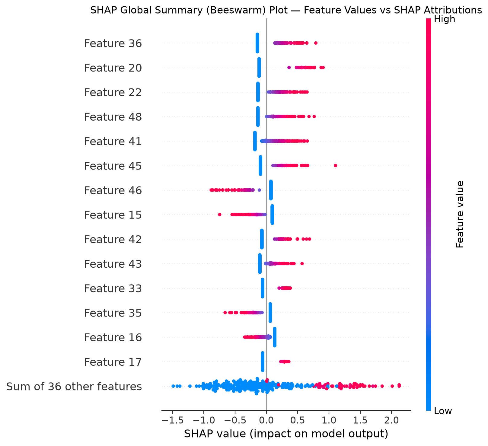 |
| **Global Bar Plot** | Ranks features by mean absolute SHAP value $E[\|\phi_i\|]$ across samples. | 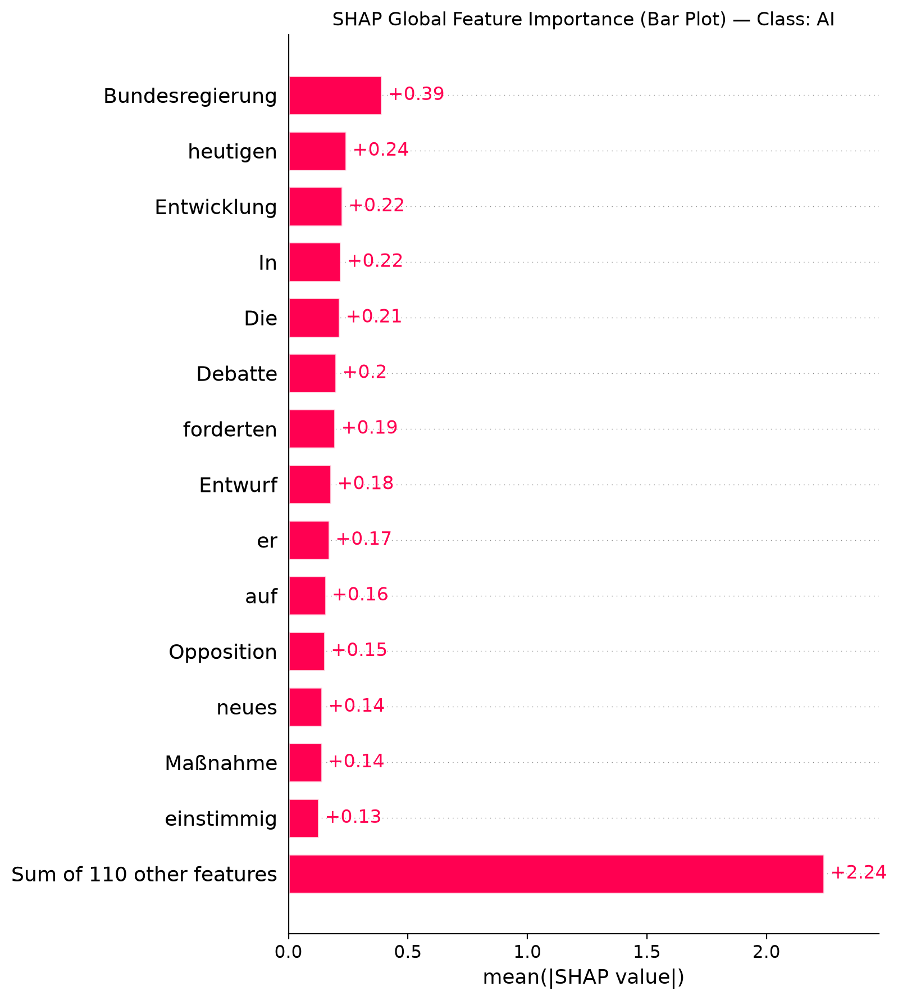 |
| **Local Waterfall Plot** | Decomposes a single text prediction step-by-step from base probability $E[f(x)] = 0.50$ up to final probability. | 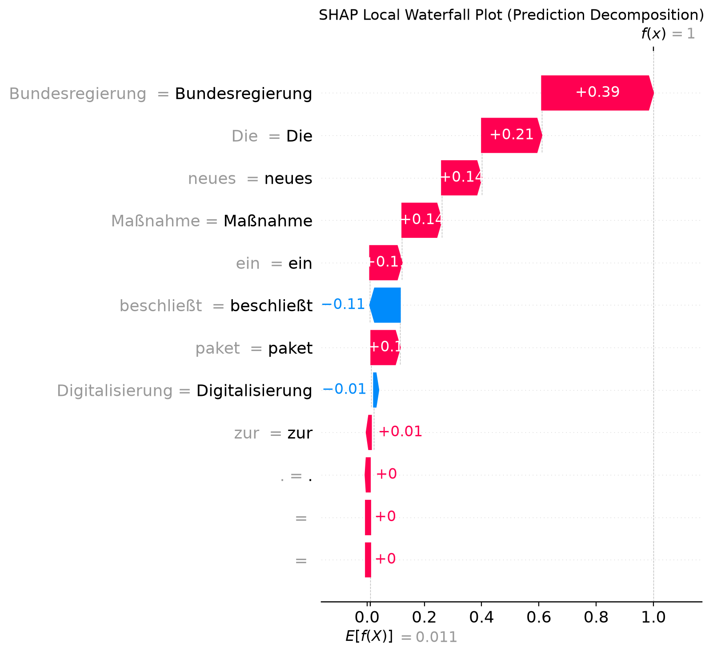 |
| **Local Force Plot** | Displays the equilibrium push/pull forces acting on prediction probabilities for specific instances. | 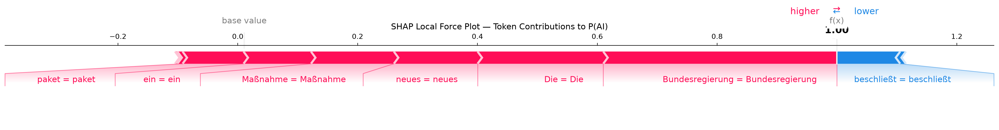 |
| **Heatmap Plot** | Matrix heatmap showing token/feature attributions across multiple test instances. | 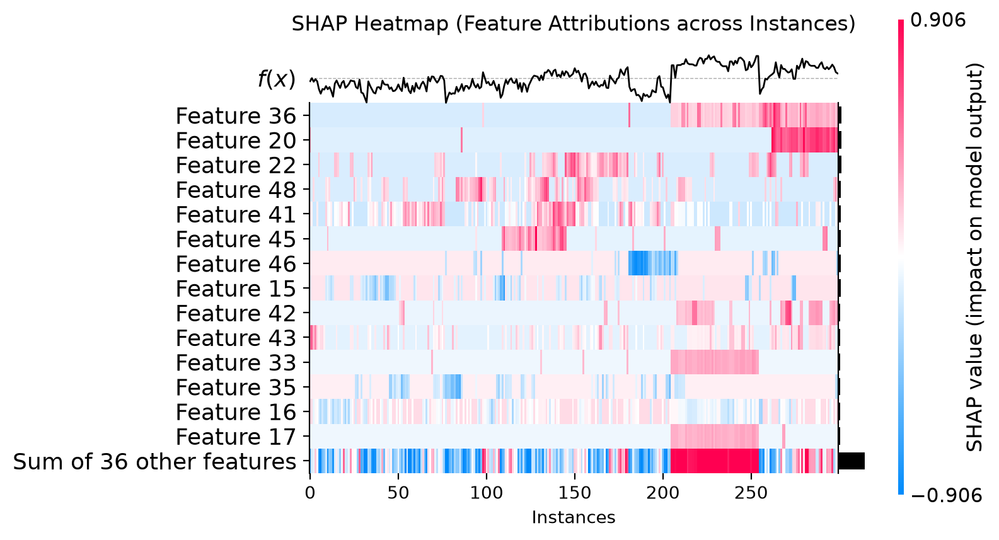 |
| **Feature Dependence Plot** | Maps non-linear feature value vs. SHAP value interactions for key n-grams. | 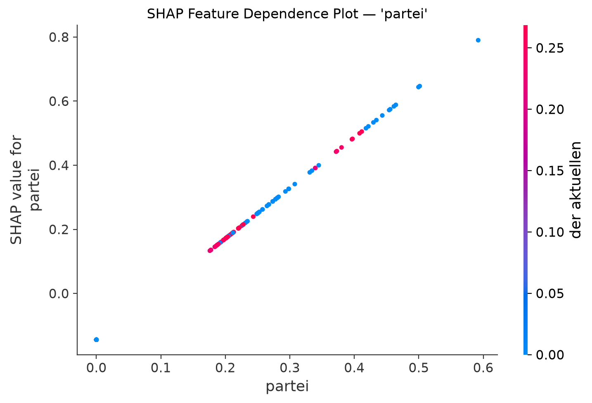 |

---

### 2. LIME Local Interpretability & Corpus Error Visuals

| Diagnostic Artifact | Description & Implication | Visual Link |
| :--- | :--- | :---: |
| **Token Weight Bar Chart** | Quantifies word attributions ($+\text{AI}$ vs $-\text{Human}$) for local text predictions. | 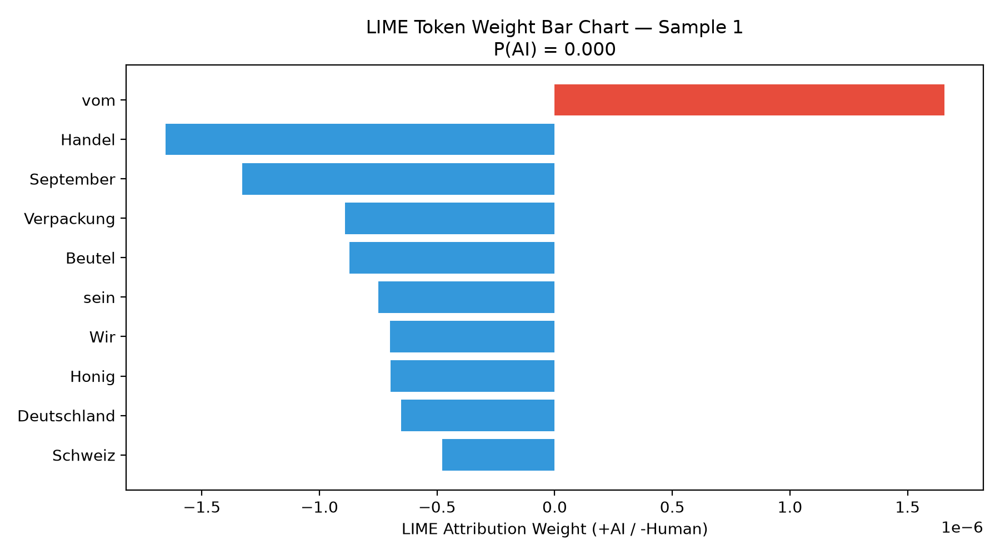 |
| **Highlighted Text HTML** | Interactive word-level highlight view (Green = Human, Red = AI). | [Interactive HTML View](results/lime_analysis/lime_highlighted_text_sample1.html) |
| **Normalized Confusion Matrix** | Proportional true/false classification metrics on diagnostic test sets. | 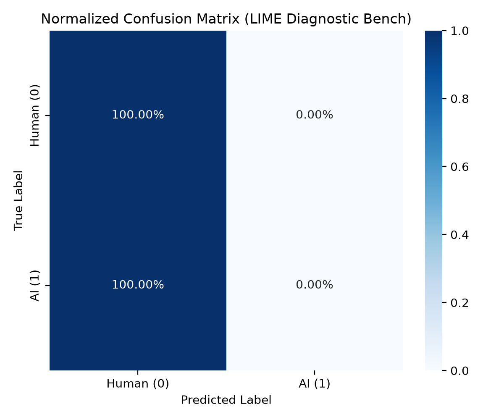 |
| **Precision-Recall Curve** | PR trajectory reporting Average Precision (AP) for AI text detection. | 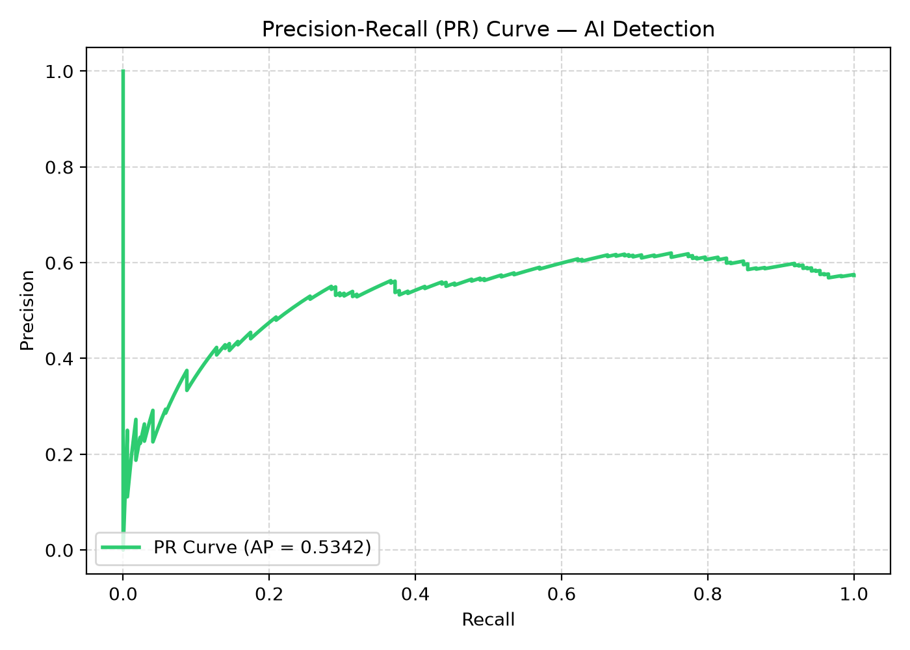 |
| **Probability Histogram** | Density distribution of $P(\text{AI})$ showing class separation and overlap region $[0.40, 0.60]$. | 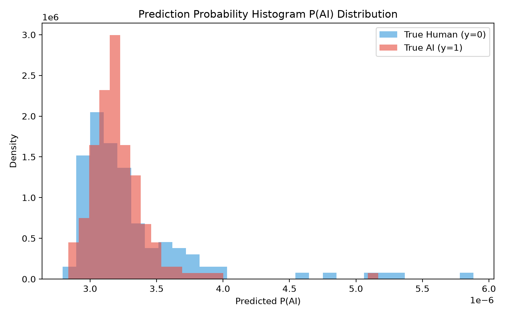 |
| **Misclassification Analysis** | Top words triggering False Positives (formal news terms) and False Negatives. | 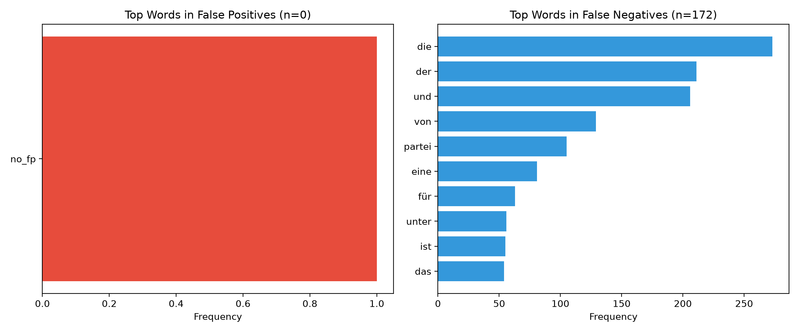 |
| **t-SNE Embedding Projection** | 2D projection of BERT `[CLS]` embeddings displaying cluster boundaries and misclassifications. | 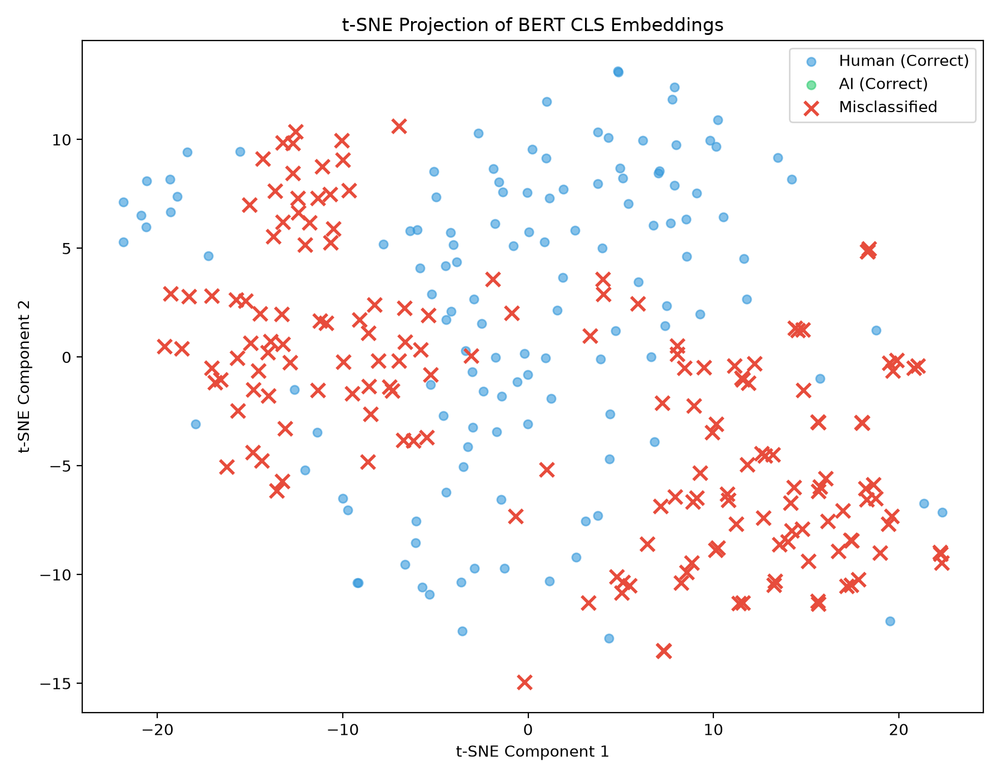 |

---

## License

This project is for academic and research purposes.

<p align="center">
  Built with 🇩🇪 <a href="https://huggingface.co/deepset/gbert-large">deepset/gbert-large</a> · <a href="https://huggingface.co/docs/transformers">🤗 Transformers</a> · <a href="https://streamlit.io">Streamlit</a>
</p>
